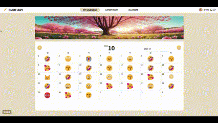

# **Emotiary(Emotion + Diary)**

**Emotiary**는 일기를 작성하면 AI로 분석하여 감정 이모지를 추출해 기록하는 캘린더 프로젝트입니다. 이 프로젝트를 통해 사용자들은 매일의 감정을 나타내는 이모지를 선택하여 캘린더를 통해 한 달 간의 감정 변화를 직관적으로 파악할 수 있게 됩니다. 네트워킹과 알림을 활용하여 다른 사용자들과 일기를 공유하고 상호 작용하며, 일기를 꾸준히 쓰는 습관을 만들어주고, 사용자들이 감정을 정리하며 더 나은 자기 인식을 얻을 수 있도록 돕는 서비스입니다.

🔗 시연 페이지 : https://emotiary-mexj6gg30-a-honey.vercel.app/

## **주요 기능 및 특징**

### **1. 일기 생성 후 이모지 선택 및 오디오 제공**

- 일기 생성, 수정 및 삭제
- 일기의 감정 분석 및 이모지 제공 후 선택 기능
- 다른 사용자의 일기 열람 가능
- 메인 화면의 먼슬리에 한 달 동안 기록된 이모지 표시
- 감정 분석 결과에 따른 음악 추천
- 월별 이모지 분석 후 이미지 제공

### **2. 댓글 및 대댓글**

- 게시글 작성시 gptAPI를 이용하여 댓글 자동으로 추가
- 댓글 및 대댓글 작성 시 이모지 분석

### **3. 전체 공개 다이어리 공유**

- 전체 공개 다이어리 조회 기능
- 유저당 좋아요 표시 기능 및 다이어리 조회 모달 연결
- 다이어리 검색 기능

### **4. 전체 유저 조회**

- 모든 유저 조회 기능
- 각 유저별 페이지로 캘린더 공유 가능
- 친구 추가 및 검색 기능

### **5. 채팅**

- 네트워킹을 위한 실시간 채팅 기능
- 로그인 시 웹소켓 연결 및 채팅방 입장

## **프로젝트 기간**

- 2023.10.02 ~ 2023.11.03

## **기술 스택 및 도구**

### AI

### 프론트엔드

### 백엔드

### 기획 및 배포

## 학습 데이터

- 감성대화 말뭉치
- 한국어 단발성 대화 데이터셋

## 감정분류

- 감정을 7가지의 라벨로 분류함
- 종류 : 분노. 행복, 불안, 당황, 슬픔, 중립, 혐오

## **프로젝트 팀원 및 역할 분담**

|  이름  |    역할    |
| :----: | :--------: |
| 김지안 |  팀장/ AI  |
| 정아현 | 프론트엔드 |
| 김용우 | 프론트엔드 |
| 이창근 | 백엔드/ AI |
| 이혜빈 |   백엔드   |
| 최은진 |   백엔드   |
| 박지호 |   백엔드   |

#### 김지안 - AI

- 감정분석 데이터 선정, AI 모델 및 Flask 서버 구축
- 스크럼 진행

#### 정아현 - FE

- axios interceptor, atom, react-query 등 프론트 프로젝트 세팅
- 인트로, 유저별, 네트워크, 모든 유저, 마이페이지 등 UI 디자인 및 구현
- 게시글, 댓글, 캘린더 모달 UI 디자인 및 구현
- 비디오 및 멀티 이미지 업로드 구현
- storybook 및 recoil을 통한 알림 메시지 및 음악 재생 모달 구현
- socket.io를 활용한 채팅 기능 구현

#### 김용우 - FE

- 소셜 로그인 및 회원가입 페이지 UI 디자인 및 구현
- 분석 컴포넌트 UI 디자인 및 구현

#### 이창근 - BE

- 유저 관련 CRUD 및 검색 API 구현
- 비디오 및 멀티 이미지 업로드 구현
- flask 배포 진행
- youtube data api를 활용한 음악 재생 구현

#### 이혜빈 - BE

- 다이어리 관련 CRUD 및 검색 API 구현
- front, back docker 배포 진행
- SSL 인증을 활용한 https 배포

#### 최은진 - BE

- 친구 관련 요청 및 조회 API 구현
- socket.io를 활용한 채팅 기능 구현

#### 박지호 - BE

- 댓글/대댓글 관련 API 구현
- 다이어리 좋아요 토글 API 구현
- 알림 메일 발송 기능 구현
- chatGPT를 활용한 자동 댓글 생성 기능 구현

## **버전**

- 0.0.1
